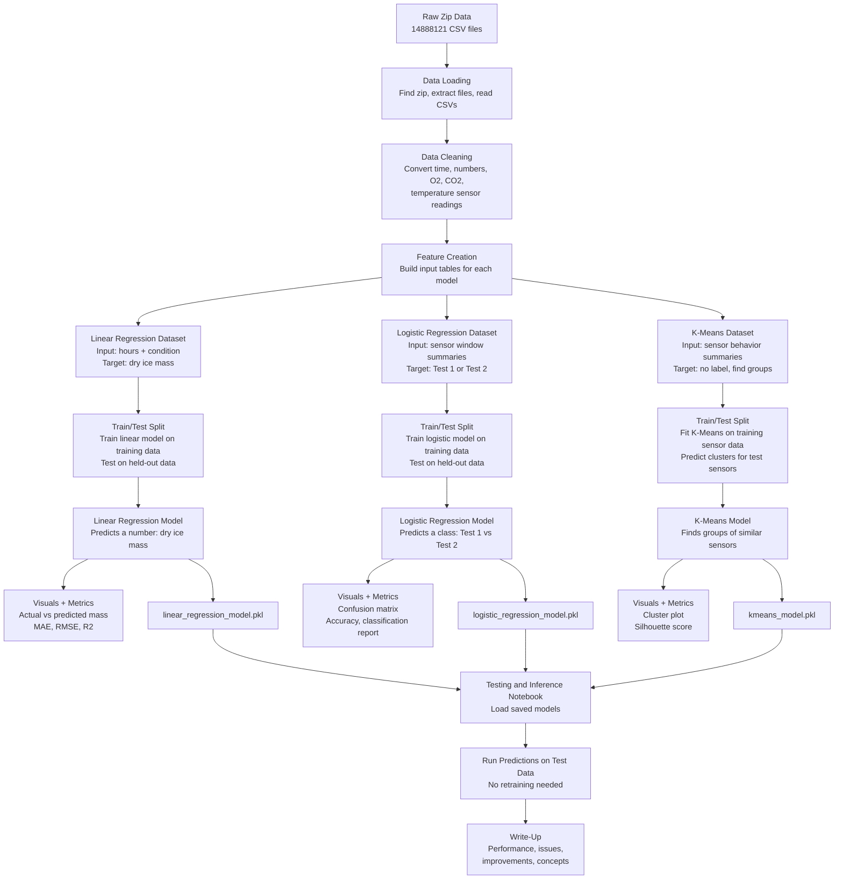
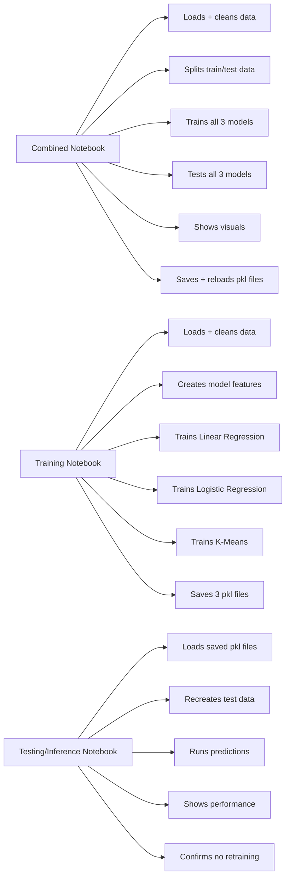
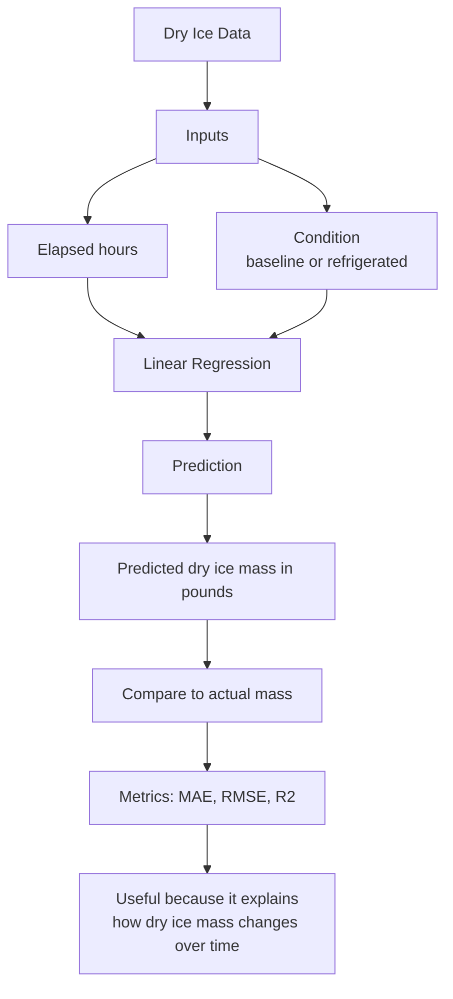
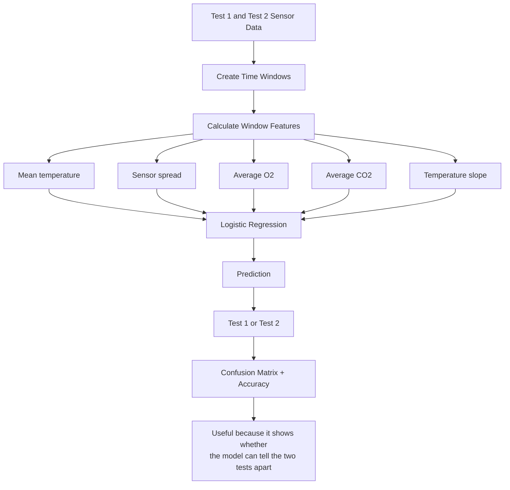
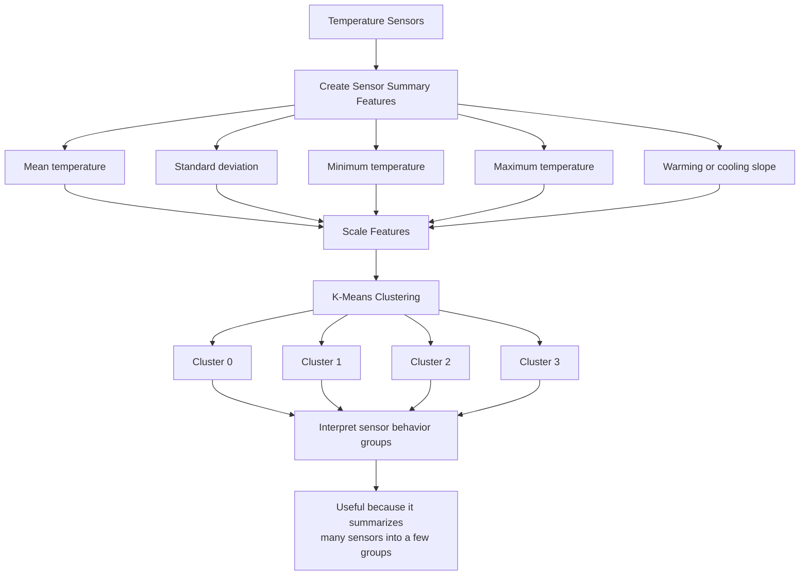
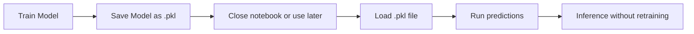
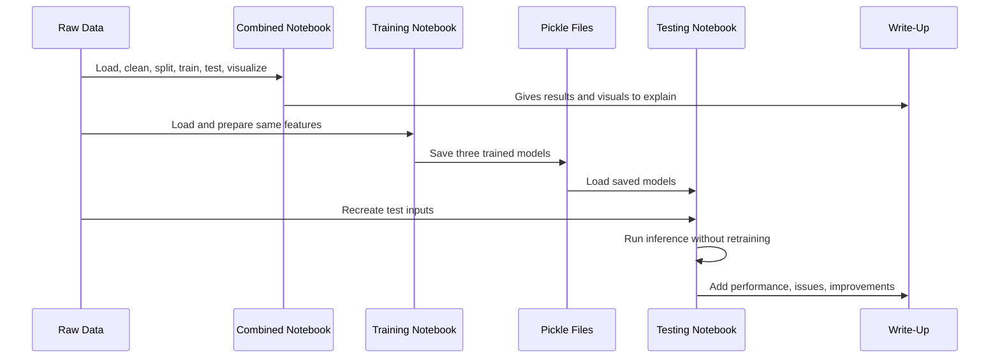

# byteSmart Visual Workflow Diagram

This diagram explains how the three notebooks, three models, pickle files, testing, inference, and write-up all work together.

## 1. Full Project Workflow

## 2. What Each Notebook Does

## 3. Linear Regression Diagram

Purpose: Linear Regression predicts a number. Here, it predicts dry ice mass. It is useful because dry ice loss is close to a steady trend, so a line can describe the pattern pretty well.

## 4. Logistic Regression Diagram

Purpose: Logistic Regression predicts a category. Here, it predicts whether a sensor time window looks like Test 1 or Test 2. It is useful because it checks whether the test conditions have clearly different patterns.

## 5. K-Means Diagram

Purpose: K-Means finds groups without being given correct labels. It is useful because there are many sensors, and clustering makes it easier to see which sensors behave similarly.

## 6. Pickle File Workflow

Purpose: Pickle files store trained models. This is useful because once the model is trained, you do not need to train it again every time. You can load the saved model and use it directly.

## 7. How the Whole System Runs Together

## 8. Simple Big Picture

The data is cleaned once in the same style across all notebooks. The combined notebook proves the full idea works. The training notebook creates reusable model files. The testing notebook proves those saved models can be loaded and used later. The write-up explains what happened, how accurate the models were, what problems exist, and how the results could be improved.

For Monday, the main concept is this:

- Training teaches the model.
- Testing checks if the model learned useful patterns.
- Inference uses the trained model to make predictions later.
- Pickle files let you save trained models so they can be reused.
