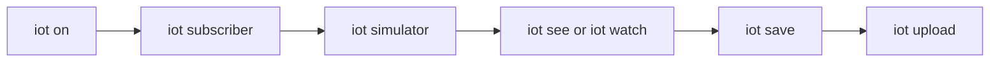

---
tags:
  - iot
  - internship
  - mqtt
  - postgresql
  - python
aliases:
  - IoT Dashboard
  - IoT Simulation Home
---

# IoT Simulation Environment Setup

> [!abstract] Internal Engineering Training Document
> Build and operate an open-source IoT pipeline that publishes simulated telemetry through MQTT, processes it with Python, stores it in PostgreSQL, and exports it for analysis in Google Colab.

## Start here

> [!success] First-time setup
> Open Terminal in this project folder and run:
>
> ```bash
> bash scripts/install_iot_shortcuts.sh
> source ~/.zshrc
> iot setup
> ```
>
> After setup, verify both shortcut names:
>
> ```bash
> iot help
> io help
> ```

> [!important] The exact command corrections
> - Correct: `source ~/.zshrc`
> - Correct manual virtual environment command: `source venv/bin/activate`
> - Incorrect: `source ~/install_iot_shortcuts.sh`
> - `io help` is now supported as an alias for `iot help`.
> - Normal `iot` commands automatically use the project virtual environment; manual activation is optional.

## One-word workflow

| Goal | Command |
|---|---|
| Set up everything | `iot setup` |
| Start PostgreSQL and MQTT | `iot on` |
| Open subscriber, simulator, and live data windows | `iot go` |
| See recent database rows | `iot see` |
| Watch rows refresh | `iot watch` |
| Export data to CSV | `iot save` |
| Export and open Google Colab | `iot upload` |
| Diagnose problems | `iot doctor` |
| Attempt safe repairs | `iot fix` |
| Open an interactive menu | `iot menu` |
| Show all commands | `iot help` or `io help` |

## Project navigation

### Architecture and setup
- [[System Architecture]]
- [[Environment Setup]]
- [[Mosquitto Setup]]
- [[PostgreSQL Setup]]
- [[Python Environment]]
- [[Publisher and Subscriber]]

### Run and manage the project
- [[Daily Startup and Shutdown]]
- [[Verification Checklist]]
- [[Database Operations]]
- [[Simple Command System]]
- [[Command Cheat Sheet]]

### Analyze and export data
- [[Analytics Overview]]
- [[Export and Upload Data]]
- [[Google Colab Guide]]
- [[Analysis Examples]]

### Fix problems
- [[Troubleshooting Index]]
- [[Shortcut and Installation Problems]]
- [[Python and Virtual Environment Problems]]
- [[MQTT Problems]]
- [[PostgreSQL Problems]]
- [[Port and Service Problems]]

## Daily operating sequence



For the easiest experience, run:

```bash
iot go
```

This starts the services and opens separate Terminal windows for the subscriber, simulator, and live PostgreSQL data viewer.

## Assignment outcome

When complete, the system will:

1. Generate Arduino- and ESP32-style telemetry every five seconds.
2. Publish JSON events to Eclipse Mosquitto on port `1883`.
3. Subscribe through a Python processing service.
4. Insert structured rows into PostgreSQL on port `5432`.
5. Query, summarize, export, and visualize the captured data.

## Important locations

| Item                    | Location                                 |
| ----------------------- | ---------------------------------------- |
| Publisher               | `src/arduino_events_simulate.py`         |
| Subscriber              | `src/subscriber_arduinoevents.py`        |
| Database initialization | `sql/init_database.sql`                  |
| Command engine          | `scripts/iotctl`                         |
| Requirements            | `requirements.txt`                       |
| CSV exports             | `exports/`                               |
| Generated charts        | `exports/charts/`                        |
| MQTT logs               | `logs/mosquitto.log`                     |
| Colab notebook          | `notebooks/IoT_Telemetry_Analysis.ipynb` |

---

Next: [[Simple Command System]]
