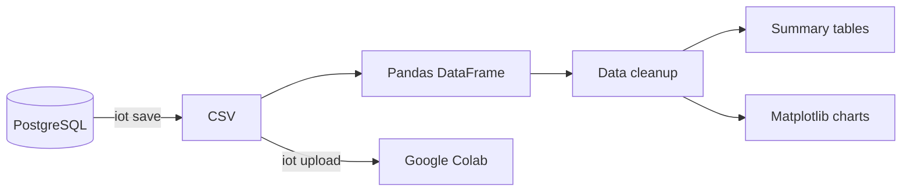

# Analytics Overview

[[00 - IoT Simulation Environment Setup|← IoT Home]]

## Workflow



## Core libraries

### NumPy
Provides efficient numerical arrays and mathematical operations.

### Pandas
Loads CSV data into a DataFrame for filtering, grouping, missing-value analysis, and aggregation.

### Matplotlib
Creates temperature, humidity, and pressure charts.

## Local analysis

```bash
iot save
iot analyze
```

Generated files are stored in:

```text
exports/charts/
```

## Colab analysis

```bash
iot upload
```

This exports the latest database data, reveals the CSV in Finder, and opens Google Colab.

---

Next: [[Export and Upload Data]] · [[Google Colab Guide]]
