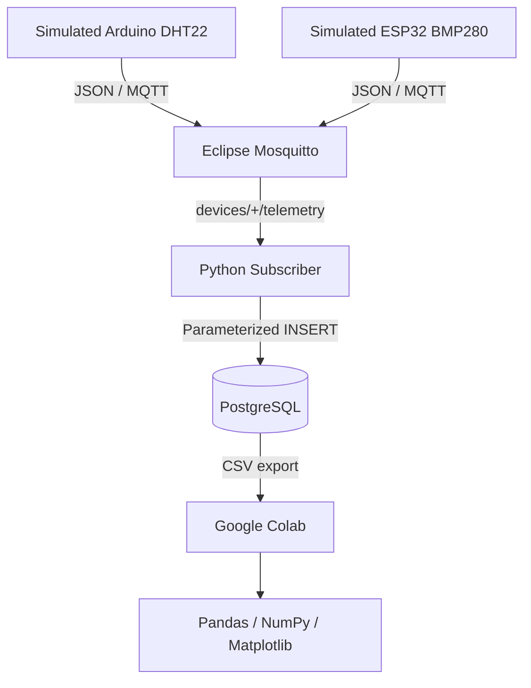

# System Architecture

[[00 - IoT Simulation Environment Setup|← IoT Home]]

## Purpose

The pipeline separates responsibilities so that publishing, transport, processing, storage, and analysis can be changed independently.

## Layers

### Ingestion layer — Eclipse Mosquitto
- Receives messages on TCP port `1883`.
- Uses publish/subscribe rather than direct device-to-database coupling.
- Accepts topics such as `devices/arduino-dht22/telemetry`.

### Processing layer — Python
- Subscribes to `devices/+/telemetry`.
- Decodes JSON payloads.
- Validates `device_id` and optional sensor fields.
- Inserts values with parameterized SQL.

### Relational storage layer — PostgreSQL
- Stores structured telemetry history.
- Supports audits, recent-state queries, summaries, and CSV exports.
- Uses indexes on timestamp and device/timestamp.

### Analytics layer — Colab and Python libraries
- Uses Pandas DataFrames for filtering and cleanup.
- Uses NumPy for numerical work.
- Uses Matplotlib for charts.

## Ports and topics

| Component | Value |
|---|---|
| MQTT host | `localhost` |
| MQTT port | `1883` |
| MQTT wildcard | `devices/+/telemetry` |
| PostgreSQL host | `localhost` |
| PostgreSQL port | `5432` |
| Database | `iot_platform` |
| Table | `telemetry_logs` |

## Failure isolation

- MQTT can continue accepting messages even when an analytics notebook is closed.
- The simulator does not need PostgreSQL credentials.
- The subscriber reports database insertion failures without corrupting payloads.
- Analytics runs from exported CSV data and does not need direct database access.

---

Related: [[Mosquitto Setup]] · [[PostgreSQL Setup]] · [[Publisher and Subscriber]]
